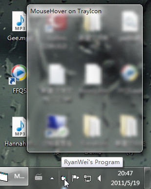



## Taskbar Icon Tray, MouseIn, MouseHover & Exit Function \- Simulation of Windows 7 show desktop button

### Description

Never ever in the history that anybody make it with so simple codes.Only 6 lines you can know wehther the mouse in, mouse hover or mouse out of the taskbar tray icon area.

It's finished at the begining of my learning VB. I decided to make it share now. At first, I saw so many replies of "that's very hard" or "that's not possible". I really hate that. So I try and try and try. I made it , you see.

The only clue before is some guys make it in C but you need to create an extra process in the system. That's really not wise. By the way most of the people need MouseHover not MouseIn. MouseIn will be too sensitive for icon in taskbar status area.

With this code you can make a simulation of windows 7 show desktop button easily now.

Attached herewith "China has wise codes" by ryanwei2005@gmail.com
 
### More Info
 

             |
---                |---
**Submitted On**   |2011-05-23 04:00:02
**By**             |[Ryan Wei](https://github.com/Planet-Source-Code/PSCIndex/blob/master/ByAuthor/ryan-wei.md)
**Level**          |Intermediate
**User Rating**    |3.8 (19 globes from 5 users)
**Compatibility**  |VB 6\.0
**Category**       |[Coding Standards](https://github.com/Planet-Source-Code/PSCIndex/blob/master/ByCategory/coding-standards__1-43.md)
**World**          |[Visual Basic](https://github.com/Planet-Source-Code/PSCIndex/blob/master/ByWorld/visual-basic.md)
**Archive File**   |[Taskbar\_Ic2204785232011\.zip](https://github.com/Planet-Source-Code/ryan-wei-taskbar-icon-tray-mousein-mousehover-exit-function-simulation-of-windows-7-show-d__1-73918/archive/master.zip)

